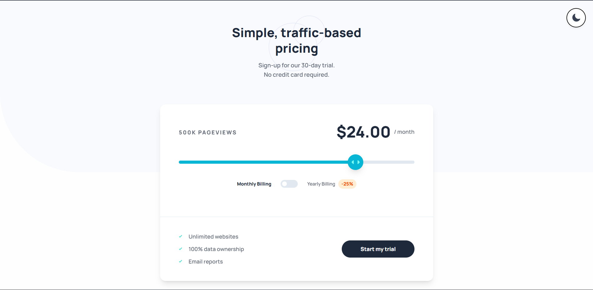
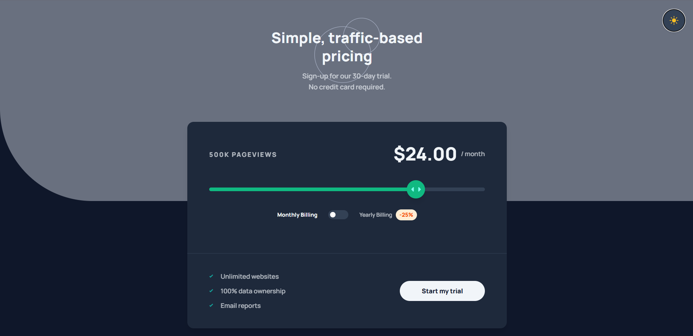
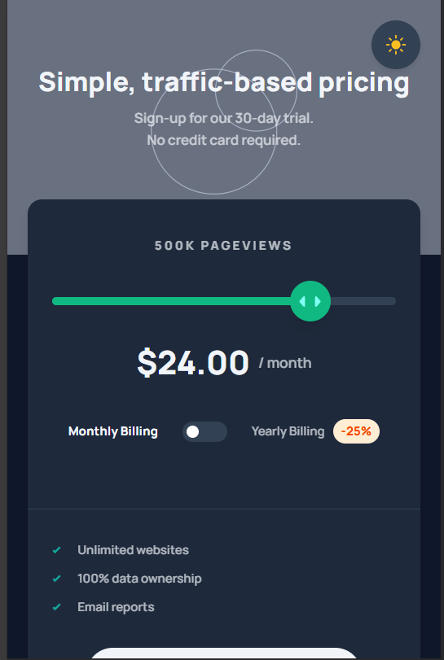

# 🎯 Interactive Pricing Component

A modern, responsive pricing component built with **Next.js 15** and **TypeScript**. Features an interactive slider, billing toggle, and dark/light theme switching for an optimal user experience.

## 📱 Preview

<div align="center">

### 🌞 Light Mode


### 🌙 Dark Mode  


### 📱 Mobile Responsive


</div>

---


## ✨ Features

### 🎛️ Interactive Controls
- **Price Slider**: Smooth, responsive slider to select different pricing tiers
- **Billing Toggle**: Switch between monthly and yearly billing with automatic discount calculation
- **Theme Toggle**: Dark/Light mode with smooth transitions and persistence

### 💰 Pricing Tiers
- **10K Pageviews** - $8/month
- **50K Pageviews** - $12/month  
- **100K Pageviews** - $16/month
- **500K Pageviews** - $24/month
- **1M Pageviews** - $36/month

### 🎨 Design Features
- **Responsive Design**: Perfect on mobile, tablet, and desktop
- **Dark Mode**: Toggle between light and dark themes
- **Smooth Animations**: Polished transitions and interactions
- **Accessibility**: Keyboard navigation and ARIA labels
- **Modern UI**: Clean, professional interface

## 🚀 Getting Started

### Prerequisites
- Node.js (v18 or higher)
- npm, yarn, pnpm, or bun

### Installation

1. **Clone the repository**
   ```bash
   git clone <repository-url>
   cd interactive-pricing-component
   ```

2. **Install dependencies**
   ```bash
   npm install
   # or
   yarn install
   # or
   pnpm install
   # or
   bun install
   ```

3. **Start the development server**
   ```bash
   npm run dev
   # or
   yarn dev
   # or
   pnpm dev
   # or
   bun dev
   ```

4. **Open your browser**
   
   Navigate to [http://localhost:3000](http://localhost:3000) to see the application.

## 🏗️ Project Structure

```
interactive-pricing-component/
├── app/
│   ├── components/
│   │   └── theme-toggle.tsx     # Dark/Light mode toggle
│   ├── globals.css              # Global styles and CSS variables
│   ├── layout.tsx               # Root layout with font configuration
│   └── page.tsx                 # Main pricing component
├── public/
│   └── images/                  # SVG icons and assets
├── README.md
├── package.json
├── next.config.ts
└── tsconfig.json
```

## 🛠️ Built With

- **[Next.js 15](https://nextjs.org/)** - React framework with App Router
- **[React 19](https://react.dev/)** - UI library
- **[TypeScript](https://www.typescriptlang.org/)** - Type safety
- **[Tailwind CSS 4](https://tailwindcss.com/)** - Utility-first styling
- **[Manrope Font](https://fonts.google.com/specimen/Manrope)** - Modern typography

## 🎮 How to Use

### 1. **Select Pricing Tier**
- Use the interactive slider to choose your pageview tier
- Click anywhere on the track or drag the slider thumb
- Use arrow keys for keyboard navigation

### 2. **Choose Billing Cycle**
- Toggle between Monthly and Yearly billing
- Yearly billing offers 25% discount
- See real-time price updates

### 3. **Switch Themes**
- Click the theme toggle button (top-right corner)
- Automatically saves your preference
- Smooth transitions between light and dark modes

## 💡 Key Features Explained

### 🎯 Dynamic Pricing Calculation
```typescript
// Yearly pricing with 25% discount
const monthlyPrice = currentPricing.price;
const yearlyPrice = currentPricing.price * 12;
const yearlyDiscountedPrice = yearlyPrice * 0.75;
```

### 🌙 Theme System
- Uses CSS variables for theme switching
- No dependency on Tailwind's dark mode classes
- Persistent theme storage in localStorage
- Smooth transitions for all elements

### 📱 Responsive Design
- Mobile-first approach
- Adaptive layouts for different screen sizes
- Touch-friendly interactions
- Optimized for all devices

## 🎨 Customization

### Modifying Pricing Tiers
Edit the `PRICING_DATA` array in `app/page.tsx`:

```typescript
const PRICING_DATA = [
  { pageviews: "10K", price: 8 },
  { pageviews: "50K", price: 12 },
  // Add or modify tiers here
];
```

### Theme Colors
Update CSS variables in `app/globals.css`:

```css
:root {
  --bg-color: #fefefe;
  --text-color: #1e293b;
  --card-bg: #ffffff;
  --border-color: #e2e8f0;
  --accent-color: #06b6d4;
}
```

## 📦 Build & Deploy

### Build for Production
```bash
npm run build
npm start
```

### Deploy to Vercel
```bash
# Install Vercel CLI
npm i -g vercel

# Deploy
vercel
```

## 🤝 Contributing

1. Fork the repository
2. Create your feature branch (`git checkout -b feature/amazing-feature`)
3. Commit your changes (`git commit -m 'Add amazing feature'`)
4. Push to the branch (`git push origin feature/amazing-feature`)
5. Open a Pull Request

## 📝 License

This project is licensed under the MIT License - see the [LICENSE](LICENSE) file for details.

## 🙏 Acknowledgments

- Design inspiration from Frontend Mentor challenges
- Icons and assets from the original design files
- Next.js team for the excellent framework
- Tailwind CSS for the utility-first approach

---

**Made with ❤️ using Next.js 15 and TypeScript**
